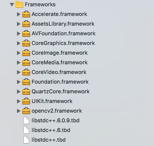

# Setup OpenCV Environment for iOS development on Xcode.
OpenCV is one of the go-to library to implement computer vision algorithm. Mobile devices, such as iPhone, with built-in front and back cameras, provide a more convenient platform than tradition laptop+webcam combination to test your computer vision code. The goal of this document is to detail the procedure to setup such environment on Xcode.

## Build OpenCV library (Framework) for ARM processor
- Download OpenCV source code: https://github.com/opencv/opencv
- Navigate to "opencv/platforms/ios/" and locate file "build_framework.py"
- Open terminal at the same directory "opencv/platforms/ios/"
- Type in terminal "python opencv/platforms/ios/build_framework.py ios" to build the framework
- It could take up to 30 minutes to finish the build. In the end, you should have "opencv2.framework" appears in "opencv/platforms/ios/ios"


## Create a New Xcode project
- Create a new Xcode project for iOS platform
- Drag the opencv2.framework just built into the framework folder on the xcode sidebar. Remeber to tick "copy if needed" because this framework needs to be copied along with the rest of the code onto the iOS device.



- In addition to the "opencv.framework", also included the rest of the framework shown in the image to the project. Those frameworks are needed because "opencv.framework" is internally calling functions from them. Also notice, these frameworks should be included natively in OSX/macOS if Xcode is installed.

## Test your setup
- Before you write any more code, let's test if everything is setup correctly.
- In the default "ViewController.m", import two library

```
#import <opencv2/videoio/cap_ios.h>
#import <opencv2/opencv.hpp>
```

- Change "ViewController.m" to "ViewController.mm" so Xcode compile the file with objective-c++
- Create a basic OpenCV Mat class in method ``viewDidLoad()``

```
- (void)viewDidLoad {
    [super viewDidLoad];
    cv::Mat image;
}
```

- Build the project (shortcut:Shift-Cmd-B)
- If the compiler does not output any error, the OpenCV develop environment on Xcode is setup successfully.

## Setup camera image feed
- To test your computer vision algorithm on an iOS device, the best image data sources are the cameras. In the last section of this tutorial, let's setup the iPhone/iPad/iPod Touch cameras and feed their image data into any CV algorithm in a cv::Mat class data container.
- The following snippet is the bare-bone code to feed the camera data into your computer vision algorithm. Follow the comment line by line; you will understand how the code works.

```Objective-C
#import "ViewController.h"
#import <opencv2/videoio/cap_ios.h> //import opencv libs
#import <opencv2/opencv.hpp>

@interface ViewController () <CvVideoCameraDelegate> //conform opencv ios camera delegate
@property CvVideoCamera *camera; //a class-wide available camera pointer
@end

@implementation ViewController{
    IBOutlet UIImageView *cameraView; //create a UIImageView in storyboard and link it to this pointer
}

- (void)viewDidLoad {
    [super viewDidLoad];
    
    //setup the camera and link the camera output to the UIImageView object in the storyboard
    _camera = [[CvVideoCamera alloc] initWithParentView:cameraView];
    
    //use the backfacing camera
    _camera.defaultAVCaptureDevicePosition = AVCaptureDevicePositionBack;
    
    //set the resolution of the camera image to medium (640x480)
    _camera.defaultAVCaptureSessionPreset = AVCaptureSessionPresetMedium;
    
    //set the orientation of the camera image
    _camera.defaultAVCaptureVideoOrientation = AVCaptureVideoOrientationLandscapeLeft;
    
    //set frame per second ceiling (if your CV algorithm is slow, it will drop frames and become smaller than this one)
    _camera.defaultFPS = 30;
    
    //the camera delegation will be implement in the same class
    _camera.delegate = self;
    
    //turn on camera (To turn off camera, use [_camera: stop])
    [_camera: start];
}
// This is the delegation method in <CvVideoCameraDelegate> that we conform to implement. What this method essentially does is that before the camera data shown on the UIImageView object on the storyboard, it goes into this method for any image manipulation. In short, this is the instagram filter!
- (void)processImage:(cv::Mat&)image { //"image" is the camera raw data already converted into cv::Mat object
    cv::Mat imageToProccess;
    cv::cvtColor(image, imageToProccess, CV_BGRA2BGR); //make a copy of the  camera raw data and convert it from BGRA to BGR (remove the alpha layer)
    
    //Here comes your computer vision algorithm
    myGreatCVAlgorithm(imageToProccess);
    
    //After "imageToProcess" is manipulated by the CV algorithm, merge it back to the camera feed to the storyboard and also add in the default alpha layer (where alpha = 1)
    cv::cvtColor(imageToProccess, image, CV_BGR2BGRA);
}
```
