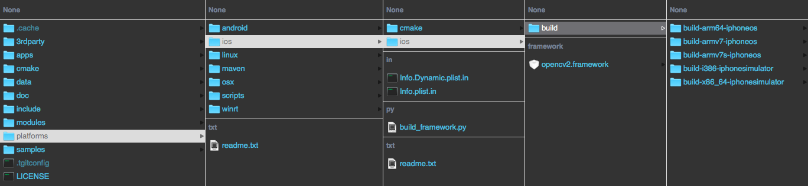

# Setup OpenCV Environment for iOS development on Xcode.
OpenCV is one of the go-to library to implement computer vision algorithm. Mobile devices, such as iPhone, with built-in front and back cameras, provide a more convenient platform than tradition laptop+webcam combination to test your computer vision code. The goal of this document is to detail the procedure to setup such environment on Xcode.
## Build OpenCV library (Framework) for ARM processor
- Download OpenCV source code: https://github.com/opencv/opencv
- Navigate to "opencv/platforms/ios/" and locate file "build_framework.py"
- Open terminal at the same directory "opencv/platforms/ios/"
- Type in terminal "python opencv/platforms/ios/build_framework.py ios" to build the framework
- It could take up to 30 minutes to finish the build. In the end, you should have "opencv2.framework" appears in "opencv/platforms/ios/ios"

## Create a New Xcode project
- Create a new Xcode project for iOS platform
- Drag the opencv2.framework just built into the framework folder on the xcode sidebar. Remeber to tick "copy if needed" because this framework needs to be copied along with the rest of the code onto the iOS device.

- In addition to the "opencv.framework", also included the rest of the framework shown in the image to the project. Those frameworks are needed because "opencv.framework" is internally calling functions from them. Also notice, these frameworks should be included natively in OSX/macOS if Xcode is installed.
## Setup camera image feed
